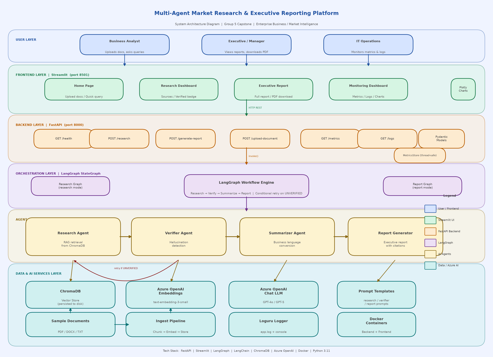

# Enterprise Business / Market Intelligence

## Multi-Agent Market Research and Executive Reporting Platform

This capstone project is an AI-powered market intelligence platform that helps business users upload approved research documents, ask market research questions, verify AI-generated insights against sources, and generate executive-ready reports with citations.

The solution demonstrates GenAI, Agentic AI, RAG, FastAPI, Streamlit, Azure OpenAI, Docker, monitoring, responsible AI controls, and Azure deployment design.

---

## Project Objectives

- Automate manual market research and competitor analysis workflows.
- Retrieve answers only from approved/sample research documents.
- Reduce hallucination risk through source-grounded RAG and a Verifier Agent.
- Generate business-friendly summaries and executive reports with citations.
- Provide a working frontend, backend, multi-agent workflow, monitoring dashboard, and deployment-ready structure.

---

## Architecture



### High-Level Flow

```text
Streamlit UI
    -> FastAPI Backend
        -> LangGraph Multi-Agent Workflow
            -> Research Agent
            -> Verifier Agent
            -> Summarizer Agent
            -> Report Generator Agent
        -> ChromaDB Vector Store / RAG Pipeline
        -> Azure OpenAI Chat + Embeddings
```

---

## Technology Stack

| Layer | Technology |
|---|---|
| Frontend | Streamlit, Plotly |
| Backend | FastAPI, Pydantic, Uvicorn |
| Agent Workflow | LangGraph, LangChain |
| LLM | Azure OpenAI Chat Model |
| Embeddings | Azure OpenAI `text-embedding-3-small` |
| Current Vector Store | ChromaDB |
| Target Azure Search Layer | Azure AI Search design path |
| Containerization | Docker, Docker Compose |
| Testing | Pytest, FastAPI TestClient |
| Monitoring | Metrics endpoint, Loguru logging |

---

## Key Features

- Upload PDF, DOCX, or TXT research documents.
- Automatically ingest uploaded documents into the vector store.
- Ask market intelligence questions from uploaded documents.
- Retrieve source-backed insights using RAG.
- Verify generated answers against retrieved source excerpts.
- Summarize findings into executive-friendly business language.
- Generate full executive reports with citations.
- Download generated reports as PDF.
- View query metrics, latency, errors, and logs.
- Use Docker/Docker Compose for containerized execution.

---

## Multi-Agent Workflow

| Agent | Responsibility |
|---|---|
| Research Agent | Retrieves relevant document chunks and generates grounded raw insights. |
| Verifier Agent | Validates whether claims are supported by retrieved source excerpts. |
| Summarizer Agent | Converts raw research insights into concise business findings, risks, opportunities, and trends. |
| Report Generator Agent | Produces executive-ready reports with citations and strategic recommendations. |

The workflow is orchestrated using LangGraph. If verification fails, the graph retries the research step once before continuing with a flagged/unverified state.

---

## RAG Pipeline

The RAG pipeline is implemented in `vectorstore/ingest.py`.

1. Load PDF, DOCX, and TXT files.
2. Split documents into chunks using `RecursiveCharacterTextSplitter`.
3. Generate embeddings using Azure OpenAI.
4. Store chunk text, metadata, and embeddings in ChromaDB.
5. Retrieve semantically relevant chunks during research queries.
6. Return citations using source filename and page metadata.

Current implementation uses ChromaDB for local/demo vector storage. For a production Azure-native implementation, ChromaDB can be replaced with Azure AI Search.

---

## API Endpoints

| Endpoint | Method | Purpose |
|---|---|---|
| `/health` | GET | Check backend health. |
| `/research` | POST | Run the research workflow and return insights, sources, verification status, request ID, and latency. |
| `/generate-report` | POST | Run the full report workflow and return executive report plus citations. |
| `/upload-document` | POST | Upload and index a PDF, DOCX, or TXT document. |
| `/metrics` | GET | Return query count, error count, average latency, token/cost concept. |
| `/logs` | GET | Return recent application logs. |

Swagger API documentation is available at:

```text
http://localhost:8000/docs
```

---

## Setup Instructions

### 1. Install Dependencies

```bash
pip install -r requirements.txt
```

### 2. Configure Environment

Copy the example environment file:

```bash
copy .env.example .env
```

Update `.env` with your Azure OpenAI values:

```env
AZURE_OPENAI_ENDPOINT=https://<your-resource-name>.openai.azure.com/
AZURE_OPENAI_API_KEY=<your-api-key>
AZURE_OPENAI_DEPLOYMENT=gpt-4o
AZURE_OPENAI_EMBED_DEPLOYMENT=text-embedding-3-small
AZURE_OPENAI_API_VERSION=2024-02-01
API_BASE_URL=http://localhost:8000
```

### 3. Generate Sample PDFs

```bash
python data/generate_sample_pdfs.py
```

### 4. Ingest Documents

```bash
python vectorstore/ingest.py
```

### 5. Start Backend

```bash
uvicorn backend.main:app --reload --port 8000
```

### 6. Start Frontend

```bash
streamlit run frontend/app.py --server.port 8501
```

Open:

```text
http://localhost:8501
```

---

## Docker Run

```bash
docker compose up --build
```

Services:

| Service | URL |
|---|---|
| Streamlit UI | http://localhost:8501 |
| FastAPI Backend | http://localhost:8000 |
| API Docs | http://localhost:8000/docs |

---

## Azure Deployment Design

Recommended Azure services:

| Requirement | Azure Service |
|---|---|
| LLM and embeddings | Azure OpenAI |
| Container hosting | Azure Container Apps |
| Container registry | Azure Container Registry |
| Secrets | Azure Key Vault |
| Monitoring | Azure Monitor / Application Insights |
| Production vector search | Azure AI Search |
| Storage for documents | Azure Blob Storage |

### Azure Container Apps Deployment Outline

1. Create Azure Resource Group.
2. Create Azure Container Registry.
3. Build and push Docker image.
4. Create Azure Container Apps Environment.
5. Deploy backend container with Azure OpenAI environment variables.
6. Deploy frontend container with `API_BASE_URL` pointing to backend URL.
7. Store secrets in Azure Key Vault for production.
8. Connect monitoring to Azure Monitor/Application Insights.

---

## Testing

Run API tests:

```bash
pytest tests/test_api.py -v
```

Current tests cover health, metrics, logs, research endpoint, report endpoint, and document upload validation.

---

## Demo Queries

- What are the top market trends in Generative AI?
- Compare Company A and Company B on innovation and market position.
- What is the projected GenAI market size by 2030?
- Identify risks and recommendations from the research documents.
- Generate an executive report on AI adoption in enterprise business.

---

## Responsible AI Controls

- Answers are grounded in uploaded documents.
- The Verifier Agent checks claims against retrieved source excerpts.
- The system returns answer-not-found behavior when source evidence is unavailable.
- Reports include citations and source references.
- Logs and request IDs support traceability.
- Human review is recommended for high-risk business decisions.

---

## Submission Artifacts

| Artifact | Status |
|---|---|
| Source code | Included |
| Architecture diagram | `architecture_diagram.png` |
| Dockerfile | Included |
| Docker Compose | Included |
| API tests | `tests/test_api.py` |
| Sample documents | `data/sample_documents/` |
| Project justification PDF | `Project_Justification_Report.pdf` |
| Code-wise justification PDF | `Code_Wise_Justification_Report.pdf` |
| Demo recording script | `Capstone_Demo_Recording_Script.md` |

---

## Important Production Notes

This project is demo/submission ready. For production, add:

- API authentication and role-based access control.
- Rate limiting to control Azure OpenAI cost.
- Azure Key Vault secret retrieval.
- Azure AI Search as production vector index.
- Azure Blob Storage for document persistence.
- Application Insights for distributed tracing.
- Stronger automated tests for agents, workflows, and RAG ingestion.
